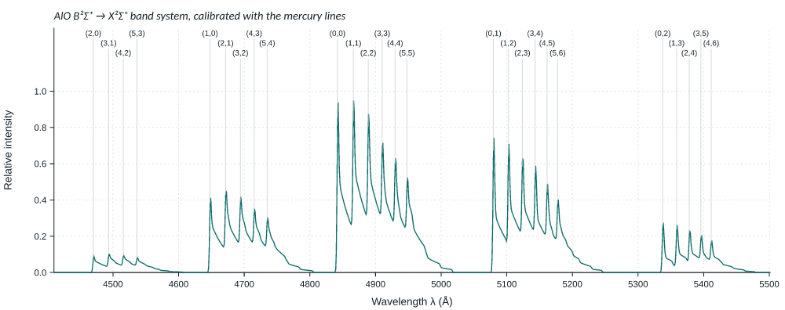
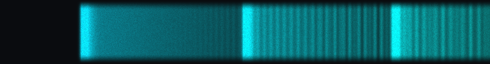
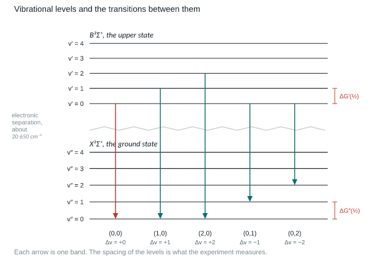
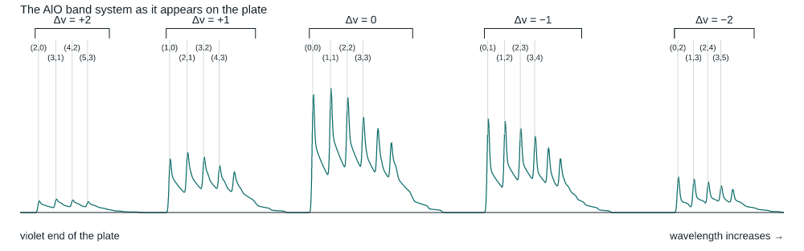
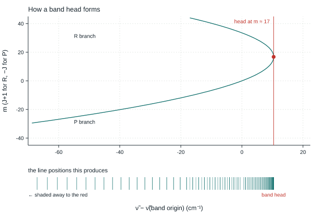

# AlO band spectrum — a virtual spectroscopy bench

A browser experiment for the M.Sc. physics laboratory: measure the band heads of the
aluminium oxide B²Σ⁺ → X²Σ⁺ system on a simulated photographic plate with a travelling
comparator, and work out the vibrational constants of both electronic states.

It follows *General Physics Laboratory V, Experiment 8* step by step — mercury calibration,
Hartmann's constants, the Deslandre tables, first and second differences, ωe and xe for each
state — and ends with a report the student can print, download or submit. Two sections come
before any of that: one explaining the structure of the band system, and one explaining how to
work the instrument.




Static site, no build step, no dependencies. Drop it on GitHub Pages and it runs.

## What the student actually does

1. **Read what is on the plate.** Why one electronic transition gives dozens of bands, why they
   fall into five groups, why the groups fade the way they do, and why each band has a sharp
   edge on its violet side — with the level diagram, the band atlas and the Fortrat parabola
   drawn from the same constants the plate is generated from.
2. **Read how to work through it.** Driving the comparator, taking a vernier reading, choosing
   the mercury lines, identifying bands from the sequence pattern, and a table of checks to make
   at each stage with what to do when one fails.
3. **Enter a register number.** The plate is generated from it, so every student measures a
   slightly different plate: different mounting offset, different camera constant, different
   grain. Copied readings are visible immediately.
4. **Measure the mercury comparison spectrum.** Drive the crosswire with the slider, the
   arrow keys (one least count) or by dragging on the plate. A magnifier shows the wire
   against the emulsion. Readings appear as M.S.R. + vernier divisions, least count 0.001 cm.
5. **Fit Hartmann's formula** λ = λ₀ + C/(d − d₀) to three chosen mercury lines. The lines
   that were *not* used become a check: the page shows the deviation of each and the r.m.s.,
   and says so when the calibration is too poor to go on.
6. **Measure the AlO band heads.** The bands are degraded to the red, so the wire goes on the
   sharp violet edge. Five sequence groups (Δv = +2 … −2) are on the plate; the block with
   v′, v″ ≤ 3 is what the Deslandre table needs.
7. **Read the analysis.** Deslandre tables in Å and in cm⁻¹, first differences taken down the
   columns and across the rows with every individual value shown, second differences, then
   ωe, ωexe and xe for each state — with the substituted arithmetic printed, not just the answer.
8. **Graphs.** The calibrated spectrum with the band assignments, the Hartmann dispersion
   curve and a Birge–Sponer line for each state, which gives the same constants from a
   straight-line fit. Each is downloadable as SVG or PNG.
9. **Report.** Print to PDF, download a standalone HTML record, export the readings as CSV,
   save a session file to resume later, or post everything to the department's Google Sheet.

Everything is stored in the browser under the register number, so a student can close the tab
and come back to a half-finished experiment.

## The numbers behind it

The plate is generated from real spectroscopic constants, so the analysis in the manual really
does return them:

| | ωe (cm⁻¹) | ωexe (cm⁻¹) |
|---|---|---|
| B²Σ⁺ upper | 870.0 | 3.50 |
| X²Σ⁺ lower | 979.23 | 6.97 |

with ν̃(0,0) = 20652 cm⁻¹ (4842 Å). Band positions come from
ν̃(v′,v″) = ν̃₀₀ + [G′(v′) − G′(0)] − [G″(v″) − G″(0)], intensities from a Boltzmann
population at 4500 K times a Franck–Condon factor that falls off with |Δv|, and plate
positions from an exact Hartmann dispersion with a per-student offset and ±0.0008 cm of
setting scatter. A student working carefully lands within about 0.5 % of ωe and 5 % of xe.

Bands are not drawn as smooth blobs. Each one is built from its rotational lines,

    ν̃(m) = ν̃_origin + (B′ + B″)m + (B′ − B″)m²,   m = J+1 (R branch), −J (P branch)

with Bv = Be − αe(v + ½), Be′ = 0.60443, Be″ = 0.64136 cm⁻¹. Since B′ < B″ the R branch turns
back at m ≈ 17 and the lines pile up: that pile-up *is* the band head the student measures, and
it sits about 10 cm⁻¹ to the violet of the band origin. Line profiles are area-normalised and
the slit width follows the zoom, so at the whole-plate view the lines merge into a shaded band
and at 0.5 cm they resolve into the comb that forms the head.



## Layout

```
index.html            the whole experiment
css/style.css
js/config.js          the one file you edit after deploying
js/physics.js         band system, rotational structure, Hartmann solver, Deslandre analysis
js/spectrum.js        plate, densitometer trace, magnifier, crosswire
js/charts.js          teaching figures, result graphs, SVG and PNG export
js/report.js          report assembly, CSV/HTML export, submission
js/app.js             the fourteen steps and all state
apps-script/Code.gs   Google Apps Script endpoint (Sheet + a Doc per student)
tests/                node scripts: physics self-check, headless walkthrough, plate render
docs/                 preview images
```

## Instructor switches

| URL | Effect |
|---|---|
| `index.html` | normal lab |
| `index.html?exam=1` | band identities and wire snapping are off and locked — students must assign the bands themselves from the sequence structure |
| `index.html?demo=1` | adds a button that fills in every reading, for demonstrating the flow |

Edit `js/config.js` to set the department name on the report header and to switch on online
submission. See [DEPLOY.md](DEPLOY.md).

## Tests

```
node tests/selftest.js       # does the analysis recover the constants, for several plates
node tests/smoke.js          # walks all fourteen steps in jsdom (npm i jsdom first)
node tests/plate-preview.js  # renders the plate through the real drawing code to docs/plate.png
node tests/chart-preview.js    # rasterises the report graphs (needs @resvg/resvg-js)
node tests/figures-preview.js  # rasterises the three teaching figures
```

## The teaching figures

All three are drawn in SVG from the same constants that generate the plate, so they cannot
drift out of step with what the student measures. None of them carries a wavelength scale —
they explain the structure without handing over the answer.






